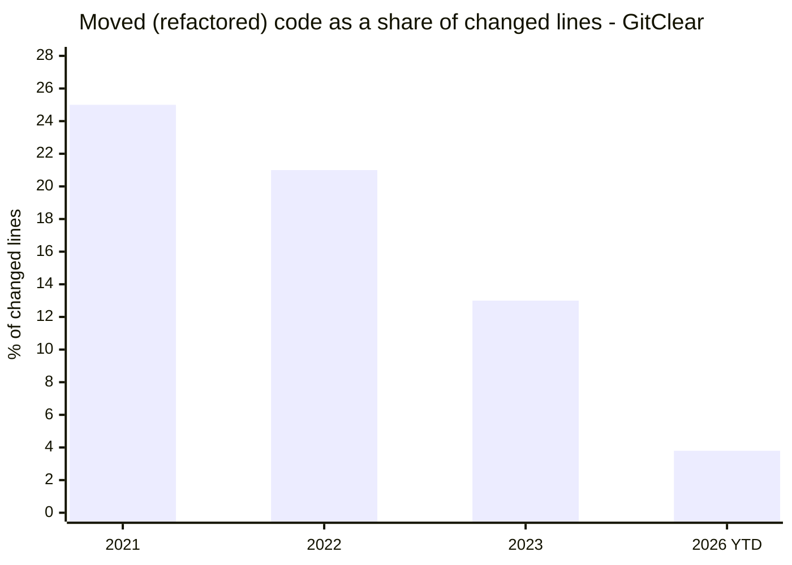
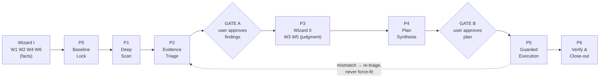
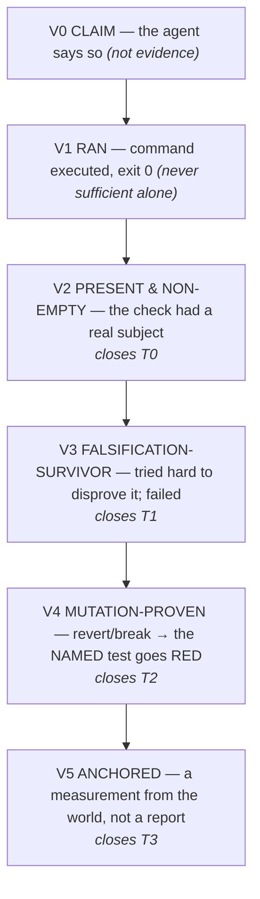
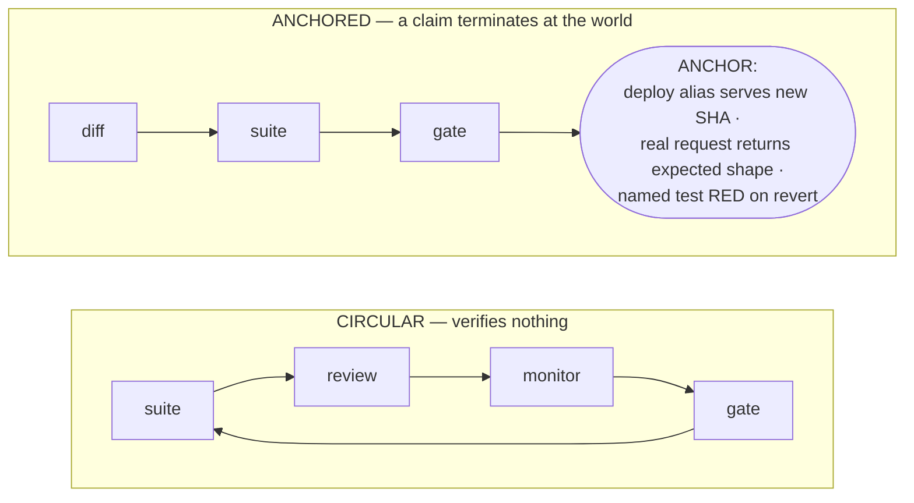

# The GUARD Framework
## A User-Driven, Zero-Breakage Framework for Deep Analysis and Optimization of AI-Built Repositories

**Version 2.1 — August 2026**
*v2.0 absorbed field-hardened verification mechanisms (the ladder, falsification, anchors, the lessons ledger). v2.1 mechanises the framework's own rules — a config schema, artifact templates, a run-state file, and a linter that fails on an empty subject — splits the wizard so answers are collected before the phases that consume them, and refreshes the evidence base to the 2026 research.*

---

## Executive Summary

**GUARD** (Ground truth → Uncover → Arbitrate → Roadmap → Deliver) is an operating framework of seven phases (P0–P6) and two hard user gates that turns any AI coding agent into a disciplined, behavior-preserving code analyst and optimizer. It targets a specific, measurable problem: repositories produced by AI agents accumulate duplication, dead code, and structural drift faster than human-written ones — GitClear's longitudinal research found blocks of five-plus duplicated lines up **~8× during 2024**, and its 2026 follow-up across **623 million analyzed changes** records block duplication at an all-time high (+81% since 2023) while moved/refactored code collapsed to **3.8%** of changes [^1][^2] — yet the same agents that could clean this up cannot be trusted to do it unsupervised: even the best AI review pipelines report **5–15% false-positive rates** (a vendor-published industry benchmark, not an academic result [^5]), and developer trust in AI accuracy fell to **~33%** in 2025, with 66% naming "almost right, but not quite" as their top frustration [^3].

Version 1.0 built the skeleton: lock the baseline, scan on dual tracks, triage by evidence, let the user drive through a wizard, execute in verified atomic steps. **Version 2.0 hardened the skeleton's load-bearing joints**, because v1's gates shared one quiet flaw — they treated "the checks ran green" as proof of safety. **Version 2.1 turns the framework's own rules on itself:** every artifact it demands now ships as a template, its config as a schema, its "mandatory" fields as a linter that fails on an empty subject, and its state as a run file a fresh session can resume from — because a framework whose thesis is "a check that cannot fail is worse than no check" cannot ship its own checks as unenforceable prose.

| # | Commitment | Mechanism (v2.1 additions in **bold**) |
|---|---|---|
| 1 | Nothing changes until behavior is locked | Phase 0 baseline + characterization tests + golden masters + mutation-proof that the net actually catches |
| 2 | No finding is acted on without evidence | Dual-track scan, confidence scoring, a falsification pass that tries to disprove every negative claim |
| 3 | The user owns every consequential decision | Six-question wizard → `guard.config.json` (**schema-validated**); two approval gates (**decisions recorded per finding in `GUARD-RUN.md` — an unrecorded gate was not passed**) |
| 4 | Every change is small, verified, reversible | Risk tiers T0–T3, atomic commits, auto-revert, a verification ladder (V0–V5) matched to tier — "green" is only V1 |
| 5 | Claims terminate at the world, not at a report | Anchors — a measurement, never a report about one; **offline anchor recipe for libraries/CLIs**; UNKNOWN blocks rather than inventing an answer |
| 6 | The framework learns from its own failures | A numbered field-lessons ledger; **a mechanisation register applying MECHANISED/DOCTRINE/OUTSTANDING to the framework's own rules** |
| 7 | Output is a plan an agent executes verbatim | `guard.config.json` + `PLAN.md` task cards with verify commands, rollback, and the proof-rung each task must reach — **machine-checked by `scripts/guard_lint.py`, which fails a plan with zero cards** |

The first half of this document is the operating playbook (§1–§11). The second half is the execution machinery: the complete **Master Prompt Suite** (§12, single-sourced from `references/prompts.md` and sync-checked at build), the **risk-communication** guide (§13), **metrics and anti-gaming** (§14), the **field-lessons ledger** (§15), **failure modes and limits** (§16), an **optional multi-agent execution mode** (§17), and a quick-start (§18).

---

## 1. Why AI-Built Repositories Need a Dedicated Framework

### 1.1 The pathology is measurable, not hypothetical

Code produced with AI assistance degrades along specific, measurable axes. GitClear's research across 211 million changed lines (2020–2024) found that in 2024 **copy/pasted lines exceeded moved (refactored) lines for the first time in history**, with blocks of five or more duplicated lines increasing roughly **8× during 2024** [^1]. The 2026 follow-up, "The Maintainability Gap" (623M analyzed changes, 2023–2026), shows the trend still steepening: duplicated blocks per million changed lines rose from 40.3 (2023) to 73.0 (2026 YTD, +81%, the highest on record); copy/pasted lines grew from 9.4% of changes (2022) to 15.7% (H1 2026); moved/refactored code fell from 21% (2022) to **3.8%** (2026 YTD) — developers are now roughly five times more likely to copy/paste than to refactor — while cross-file call density dropped 35% and two-week churn rose 15% [^2].



*Duplication moves in the mirror image: 40.3 → 73.0 duplicated blocks per million changed lines, 2023 → 2026 YTD (+81%) [^2].*

Duplication is not cosmetic: field studies find cloned code disproportionately represented in bug-fix commits and carrying more severe bugs, and inconsistent changes to clones are a classic fault source — though the literature is genuinely mixed, with some studies finding well-managed clones no buggier than average [^6]. Churn compounds it: Nagappan & Ball's Microsoft study showed relative code churn predicts defect density well enough to discriminate fault-prone from healthy binaries with 89% accuracy [^7]. And an analysis of 153 million lines concluded that AI-generated output "resembles that of a developer unfamiliar with the projects they are altering," corroding DRY-ness because the assistant cannot reliably reuse existing code [^2].

Beyond duplication, generated code repeats a recognizable set of semantic failure modes that linters cannot see: broad catch-all handlers that swallow failures, defensive guards for impossible cases, premature abstraction, hallucinated APIs and packages, hardcoded "success" returns, and plausible-but-wrong logic that compiles and reads correctly while encoding a subtly wrong boundary or null semantic. Spracklen et al. measured that **19.7% of package references recommended by LLMs are fabricated** — 440,445 of 2.23M references across 16 models [^4]. These are the defects a cleanup framework must both avoid introducing and actively surface — and they are precisely why "let the AI that made the mess clean it up" needs a governing protocol rather than a prompt.

### 1.2 The cleaner cannot be trusted to clean unsupervised

AI code review produces false positives at a reported **5–15%** rate even in the best current pipelines (vendor benchmark [^5]); 66% of developers cite "almost right, but not quite" as their top frustration, 45% say debugging AI-generated code costs more time than it saves, and trust in AI accuracy fell to ~33% in 2025 [^3]. The credible mitigations are consistent: retrieval grounding, guardrails, verification layers, and hybrid static-analysis-plus-LLM pipelines that reach precision neither approach achieves alone. The architecture that works is **layered** — deterministic analysis first, LLM judgment second, verification third, human authority last. GUARD institutionalizes that layering as an enforceable pipeline, then adds the ingredient layering alone does not provide: a way to tell a *real* verification from a *plausible-looking* one.

### 1.3 Refactoring science already solved "don't break it" — for humans

The safety half of GUARD adapts two decades of discipline. Michael Feathers defines legacy code as **code without tests** and prescribes: find change points, find test points, break dependencies, cover with **characterization tests** that capture what code *actually* does, and only then refactor — never outside test-covered code [^8]. For changes too large for one safe step, the industry converged on the **Strangler Fig**, **Branch by Abstraction**, **Parallel Run**, and **expand-and-contract** patterns [^10], and on the **Mikado Method** — attempt the change, record what breaks as prerequisites, **revert everything**, work the leaves first, staying always-green [^11]. GUARD's contribution is wiring these human disciplines into an agent-executable protocol with explicit user control points, then hardening the verification layer so that "green" actually means safe.

---

## 2. Design Principles

Eight principles govern every phase; §12 embeds them verbatim into the agent's standing instructions.

**P1 — Behavior preservation outranks cleanliness.** A finding is actionable only if fixing it provably preserves observable behavior. When specification and actual behavior disagree, actual behavior wins, because that is what users depend on [^8].

**P2 — Evidence before action, and falsification before trust.** Every finding carries an evidence class, and every *negative* claim (this is dead, this has no callers, this is missing, this is unreachable) must survive an explicit attempt to disprove it before it can drive a deletion. This is the discipline that kills false-positive removals — the single most dangerous action in any cleanup.

**P3 — The user is the operating authority.** Scope, risk appetite, autonomy, and every elevated-risk change are decided by the user through the wizard and two hard gates — and every gate decision is **recorded per finding** in `GUARD-RUN.md`, so a fresh session can verify a gate was passed rather than take the conversation's word for it.

**P4 — Small batches, always green.** One task, one concern, one atomic commit. On any verification failure the agent reverts to the last green state instead of debugging forward [^11].

**P5 — A claim is labeled by how it is known.** Every statement the framework makes about the code is tagged **VERIFIED** (established by running something), **STATED** (asserted from reading, not yet run), or **UNKNOWN** (the environment could not determine it). UNKNOWN is a real verdict and it **blocks**; collapsing it into a confident-sounding answer is how gates get passed on nothing.

**P6 — Verification has a ladder, and "green" is the bottom rung that counts.** A command that ran (V1) is not evidence the check works (V2–V4) or that the world changed (V5). Each risk tier has a minimum rung (§4.4). The most dangerous sentence in software is "the suite passed."

**P7 — Claims terminate at anchors.** A report about a measurement is not a measurement. Where it matters, verification must touch the world directly — the deployed alias serves the new SHA, the endpoint binds a port, the named test goes red when the change is reverted — not just consume another green report.

**P8 — The framework degrades gracefully, learns, and polices itself.** No tests, no build, no CI → GUARD shifts weight into Phase 0 rather than refusing [^8]. Every failure the framework itself causes is recorded as a numbered lesson (§15). And every rule the framework declares is itself classified MECHANISED, DOCTRINE, or OUTSTANDING — a rule with no mechanism must say so plainly rather than pose as a check.

---

## 3. Framework Overview

GUARD runs as a one-way pipeline — seven phases, P0–P6 — with two mandatory user gates and one verification loop. No phase may be skipped; each phase's exit criteria are the next phase's entry ticket. Run state lives in `GUARD-RUN.md` (template in `assets/templates/`): current phase, wizard answers, per-finding gate decisions. A fresh session resumes from it and never re-runs completed phases.

The six wizard questions are split on one principle — **facts first, judgment after evidence.** W1 (trigger), W2 (scope), W4 (believed safety net), and W6 (delivery) are facts the user already knows and P0–P2 consume, so they are asked **before P0** (Wizard I) and written to a provisional `guard.config.json`. W3 (appetite) and W5 (autonomy) are risk judgments best made while looking at triaged findings, so they are asked **at P3** (Wizard II), which finalizes the config. §8 details the split.



| Phase | Name | Core question | Key artifacts | Gate / proof |
|---|---|---|---|---|
| 0 | **Baseline Lock** (opens with Wizard I) | "What does the system do today, and how would we know if it stopped?" | provisional `guard.config.json`, `GUARD-RUN.md`, `BASELINE.md`, characterization tests, golden masters, metrics, clean tag | **Net is mutation-proven** |
| 1 | **Deep Scan** | "Where is the code unclean, redundant, or suboptimal?" | `FINDINGS.raw.json` (tools + LLM, dual-track, W2-scoped, generated/vendored code excluded) | — |
| 2 | **Evidence Triage** | "Which findings are real, and how dangerous is each fix?" | `FINDINGS.triaged.md` — confidence + tier + proof-rung + **falsification result** + DYNAMIC-ZONE register | **Gate A** (decisions recorded) |
| 3 | **User Wizard II** | "How much risk, with what brakes — now that the evidence is on the table?" | final `guard.config.json` (schema-validated) | — |
| 4 | **Plan Synthesis** | "In what order, verified how, does each change land?" | `PLAN.md` task cards, each with a required proof-rung; **linted, zero cards = fail** | **Gate B** (decision recorded) |
| 5 | **Guarded Execution** | "Did this one change preserve behavior? Prove it." | Atomic commits, `EXECUTION.log`, task ledger in `GUARD-RUN.md` | Per-task/batch (W5) |
| 6 | **Verify & Close-out** | "Is the whole provably equivalent — and measurably better?" | `DELTA.md` with **anchored equivalence evidence** | User sign-off |

The pipeline is linear up to Gate B and iterative after it: execution loops task-by-task through verification, and any mismatch routes back to re-triage rather than being force-fit. The difference from a naive gated workflow is that every gate's definition of "passing" is specified as a rung on the verification ladder, not as the word "green."

---

## 4. The Verification Ladder

This is the conceptual heart of the v2 line, and the single most important thing the absorbed field record teaches. Every safety gate in software eventually reduces to a check that returns green. The field lesson — learned across container restarts, phantom test failures, and a production deploy that served the wrong SHA — is that **a green signal is truthful about itself and can be worthless as evidence for the thing it is cited for.** A typecheck exiting 0 is truthful *about the typecheck having run*; it says nothing about whether the typecheck could see the code (a missing `@types/react` makes it blind to every JSX prop while still exiting 0). A "no dead callers" report is truthful about the grep having run; it says nothing about the plugin registry that calls the function by name at runtime.

The fix is to stop treating verification as binary and start treating it as a ladder of increasing strength, where each rung answers a harder question than the one below.



### 4.1 The six rungs

| Rung | Name | The question it answers | How it is established |
|---|---|---|---|
| **V0** | Claim | "The agent says so." | Nothing. A claim is not evidence; it is the *starting point* for verification. |
| **V1** | Ran | "Did the check execute and exit 0?" | Run the command; capture its real exit code and output. |
| **V2** | Present & non-empty | "Did the check actually have a subject?" | Prove the check is not *satisfiable by absence*: the file exists, the tree is non-void, the route is routed, the input is non-empty. |
| **V3** | Falsification-survivor | "Did we try hard to disprove it and fail?" | For a negative claim, actively search for the counterexample (dynamic refs, alternate names, generated code, another layer). |
| **V4** | Mutation-proven | "Would the net *catch* this if it were wrong?" | Revert or deliberately break the change; watch the **named** test go **red**; restore. |
| **V5** | Anchored | "Does a measurement from the world confirm it?" | Touch reality directly: the deployed alias, a bound port, a real request's response shape, a consumer that actually ran the artifact. |

### 4.2 The three pathologies the ladder kills

**Satisfiable by absence (defeated by V2).** A check that cannot distinguish "absent" from "correct" is not a check. `git status | wc -l` returning `0` reads as "clean tree" but is identical when `git status` *failed*. A verifier printing a green tick on a 404 is indistinguishable from the endpoint existing. A tenant-isolation script that only fails when *both* tenants are empty "proves" isolation while testing nothing. The rule: **every check asserts its own preconditions before it asserts its subject** — non-empty inputs, the route actually routed, both sides of a comparison non-trivial. And **test for the answer you want, never against the one you don't**: `state == "clean"` is safe; `state != "dirty"` is satisfiable by absence (an absent field, an error envelope, and a null all satisfy it).

**A check that cannot fail (defeated by V4).** A test that passes when the behavior it names is deleted is worse than no test, because it reports a capability that does not exist. The proof of reachability is a **revert-mutation**: revert the change (or introduce the defect), run, and watch the *specific named case* go red, then restore. Naming the case matters — "the suite went red" is satisfied by *any* case failing, and a mutation run can go red on the wrong case while the case under test stays green. This is the same discipline as mutation testing (StrykerJS, mutmut, pitest, cargo-mutants), applied surgically and cheaply to the exact change at hand rather than as a whole-repo score [^12] — and it is where the industry is heading: Meta's ACH system now deploys LLM-generated mutants with mutation-guided test generation at production scale [^13].

**A report about a measurement (defeated by V5).** The gate reads the suite; the suite reads fixtures; the review reads the diff; the monitor reads a status file. Every loop can watch another loop while **no loop touches the ground** — a circular graph that is internally consistent and verifies nothing. The correction is the **anchor**: a measurement that cannot be argued with because it came from the world rather than from a dashboard.



### 4.3 Anchors, and the third verdict

An anchor is the terminal node of a claim — the point where the chain of "X reports Y" ends in a direct observation of the world. The five canonical anchors, each one the ghost of a real near-miss:

| Anchor kind | The claim it grounds | The direct probe (not a report) |
|---|---|---|
| `deploy` | "the fix shipped" | read the production alias; confirm it serves the **new SHA**, not the previous merge's |
| `runtime` | "the feature is live" | enumerate the deployed modes and confirm the feature on the mode production *actually runs* (not only the inline path) |
| `endpoint` | "the service is ready" | make a **real request** and assert the response carries the expected key — not "the control plane says ready" while nothing bound a port |
| `gate` | "the check is real" | break the subject, watch the gate fail, restore — proving the gate can see its defect class |
| `status` | "the PRs merged" | query for the answer you want (`state == 'closed'`), never the absence of the unwanted one |

**Offline anchors.** A library, CLI, or package that never deploys still terminates at the world: the `gate` anchor applies unchanged, and a **consumer-smoke anchor** replaces deploy/runtime/endpoint — build and pack the artifact, install it into a scratch consumer project, make one real call, and assert the discriminating detail of the result. "The library works" is grounded by a consumer that actually imported and ran it, not by the library's own suite reading its own fixtures.

Anchors have **three outcomes, never two**: `ANCHORED`, `UNANCHORED`, and **`UNKNOWN`**. The third is the whole point. A negative test against a possibly-absent field converts "there is no answer here" into a definite answer, and the definite answer it invents is the one that lets a gate be passed. UNKNOWN must be said out loud and must **block** — because a check that could not tell is not a pass. Finally: **the anchor set is frozen.** An optimizing loop's strongest temptation is to weaken an anchor to make everything green; loosening an anchor to unblock a delivery is not a shortcut, it is the failure.

### 4.4 Mapping rungs to risk tiers

The ladder is not decorative — it sets the *minimum* proof each tier of change must reach before it counts as done. This is the routing table that replaces "be careful."

| Tier | Change examples | Minimum rung to close | What that means in practice |
|---|---|---|---|
| **T0** mechanical-safe | delete tool-verified dead file, remove unused dep, rename private symbol | **V2** | build+typecheck+suite green, *and* the deletion target proven non-empty / the dep proven actually present first |
| **T1** standard | consolidate in-module duplicates, split a long function | **V3** | every "these are duplicates / this is unreachable" claim survives a falsification probe; characterization tests green |
| **T2** elevated | cross-module consolidation, shared-util changes | **V4** | revert-mutation: the named boundary test goes red when the change is reverted; golden-master diff reviewed |
| **T3** critical | data schema, API payloads, auth, money logic | **V5** | coexistence + flag (Off=old) + staged rollout, closed only by an anchor (deploy/runtime/endpoint/consumer-smoke), never by a status report |

Two rules sit above the table. **Budget the work, never the verification**: a brief that says "the typecheck is slow, run it at most once at the end" will be obeyed exactly, and has shipped unverified fixes — narrow a check's *scope*, never its *count*. And **a failed command must never read as a benign value**: `|| echo 0` turns a failed count into "nothing to do," so the semantic class — any command whose failure and whose negative answer are the same value — must be swept, not just the syntax last fixed.

---

## 5. Phase 0 — Baseline Lock (opens with Wizard I)

### 5.1 Purpose and non-negotiables

Phase 0 opens by asking **Wizard I** — W1 (trigger), W2 (scope), W4 (believed safety net), W6 (delivery) — writing the provisional `guard.config.json`, and creating `GUARD-RUN.md` from the template. Everything downstream consumes those answers: scope bounds the net-building and the scan, delivery decides where the baseline commit lands, the W4 *belief* is recorded so P0 can verify it against reality.

The Baseline Lock then answers Feathers' question — "if I change this, how do I know I didn't break anything?" — before any optimization is proposed [^8]. Its output is a frozen reference point: a git tag, a green build, a behavior-capturing test layer, and a metrics snapshot. Nothing downstream may proceed against a red or unknown baseline, because a failing baseline makes verification meaningless — the agent can no longer distinguish "I broke it" from "it was already broken." GUARD does not debug: on a red build or suite it **stops and reports with options**, and the user decides — fix first, characterize around, or waive with the waiver recorded in `BASELINE.md`.

One hard requirement v1 only implied: **the safety net must be proven to catch, not just to exist.** A suite that passes is V1. Before any T2+ work, the net covering that code must reach V4 — revert-mutation proof that a named test goes red when the behavior is broken. A net that has never been watched failing is an assumption, not a safety net. P0 records the **verified** net per module beside the user's W4 belief; a discrepancy ("believed: tests; verified: tests that catch nothing") is itself a finding, reported at Gate A.

The phase runs four workstreams in order. **Environment discovery** — record install/build/test/lint/start commands with their real outputs in `BASELINE.md` (one subsection per package in a monorepo). **Stability check** — build and existing tests must pass; failures are documented and the user decides. **Behavior capture** — characterization tests and golden masters for in-scope modules [^8]. **Metrics snapshot** — duplication, complexity, dead code, coverage, dependency inventory, so Phase 6 can prove improvement numerically.

### 5.2 The behavior-capture toolkit (with proof obligations)

| Instrument | Best for | Strength | Known limit | Proof obligation |
|---|---|---|---|---|
| Characterization tests | logic-heavy functions | pinpoints *which* behavior changed | labor-intensive | each must fail when its behavior is broken (spot-mutate one) [^8] |
| Golden master / approval | reports, serializers, HTML, JSON | whole-output equivalence in one diff | fossilizes detail if never retired; binary outputs need a comparator (render-then-diff, tolerance rules) | prove the harness detects a deliberate output change |
| API contract tests | HTTP/RPC boundaries | guards the consumer-visible surface | says nothing about internals | assert preconditions (route routed, payload non-empty) |
| Property-based tests | parsers, pure logic | explores input space | properties inferred from behavior | seed must reproduce a found failure |
| Type check / build | everything, always | cheapest regression signal | types ≠ behavior | confirm the checker can see the files (no silent skip) |
| Mutation score (scoped) | critical paths pre-T2+ | proves the net bites | compute-costly; run scoped [^12] | report the score band, not a vibe |

Golden masters must be **scrubbed of secrets and PII before commit**. Coverage alone is not evidence of a working net — it measures which lines execute, not whether tests would fail if those lines were wrong; a suite can report 100% coverage while surviving mutants prove it asserts nothing [^12]. For any module slated for T2/T3, run a scoped mutation check and treat a score under ~60% as "net too weak — strengthen tests first."

**The gate-proof step:** for each module entering scope, pick one representative characterization test and *prove* it — temporarily break the behavior, watch the named test go red, restore. Record the proof in `BASELINE.md` next to the metric. This converts the net from V1 to V4 before it is ever relied on.

### 5.3 Metrics to snapshot

| Metric | JS/TS tool | Python tool | Healthy target | Why |
|---|---|---|---|---|
| Duplicated lines/blocks % | jscpd v5 (≥50 tokens, ≥5 lines) | jscpd / PMD CPD | < 3–5% | #1 AI-era pathology [^2] |
| Dead files/exports/deps | Knip | vulture; Ruff F401/F841 (imports/vars only — Ruff does not find dead functions); deptry (deps) | 0 unresolved | bundle size, misdirection |
| Cyclomatic complexity (max, p95) | ESLint `complexity` | radon, or Ruff C901 | ≤ 10/function (NIST); warn 15, gate 25 [^14] | path count = test burden |
| Maintainability index | SonarQube Server/Cloud | radon MI | ≥ 20 green; < 10 red | find red-zone outliers |
| Cognitive complexity | SonarQube (Sonar) | — | trending down | human load better than CC |
| Coverage (line/branch) | Vitest/Istanbul | coverage.py | context floor | necessary, not sufficient [^12] |
| Mutation score (critical) | StrykerJS | mutmut | 75–85% solid, 90%+ excellent [^12] | proof the net bites |
| Dependency health | Knip, npm audit | deptry, pip-audit | none unused/unlisted | phantom/missing deps |
| Churn (90 days) | git log | git log | watch top decile | churn predicts defect density [^7] |

**Exit criteria (Phase 0):** Wizard I answered and recorded; provisional config written; clean tagged commit on the W6 delivery base; build green; tests green or user-waived; net in place for in-scope modules **and at least one net element per module mutation-proven**; verified net_status recorded beside the W4 belief; `BASELINE.md` committed with commands, metric values, and the net-proof records; `GUARD-RUN.md` updated.

---

## 6. Phase 1 — Deep Scan (Uncover)

### 6.1 Three lenses, two tracks — scoped, with the noise excluded first

The scan is bounded by the W2 allow-list, and its first act is exclusion: enumerate generated and vendored paths — build output, codegen and client stubs, protobuf output, vendored libraries, migrations, minified bundles — and record them in `scope.deny`. Generated code is *expected* to look duplicated and dead; scanning it floods `FINDINGS.raw.json` with noise and burns falsification effort on files nobody hand-maintains.

The scan then examines the repo through three lenses — **cleanliness** (structure, naming, complexity, consistency), **redundancy** (duplicates, dead code, overlapping abstractions), **optimization** (inefficient patterns, bundle/runtime waste, dependency bloat) — each executed as two independent tracks. **Track 1** is deterministic tooling. **Track 2** is the LLM's semantic review for smells tools cannot express. Track separation is what makes triage possible: agreement is the strongest confidence signal, disagreement routes to verification, not the delete key.

The smell vocabulary for Track 2 is Fowler's catalog — **Bloaters**, **Change Preventers**, **Dispensables**, **Couplers**, **Obfuscators** [^9] — plus the **AI-specific failure modes** that generated code repeats systematically: swallowed-failure catch-alls, defensive guards for impossible cases, premature abstraction, comment pollution, duplication over reuse, hallucinated APIs, intent-less naming, and hardcoded "declares success" returns. For AI-built repos add five targeted probes: near-duplicate utilities with subtly different signatures (the GitClear signature [^2]); unused speculative abstractions; inconsistent error-handling idioms across modules written in different sessions; phantom dependencies from abandoned spikes; and comment/code drift where docstrings describe an older implementation.

### 6.2 Tooling matrix (current as of August 2026)

| Lens | JS/TS | Python | JVM | Go | Rust | Cross-language |
|---|---|---|---|---|---|---|
| Dead code | **Knip** (ts-prune is archived, superseded by Knip) | vulture; Ruff F401/F841 for imports/vars | PMD, ProGuard | `deadcode` (golang.org/x/tools), staticcheck | `cargo clippy` + rustc `dead_code` lints | SonarQube |
| Duplication | **jscpd** v5 | jscpd, pylint | PMD CPD | jscpd, dupl | jscpd | Sonar CPD |
| Complexity | ESLint, SonarJS; Biome 2 / oxlint as fast lint layers | radon/xenon, or Ruff C901 | MetricsReloaded | gocyclo | clippy cognitive-complexity | SonarQube |
| Dependency health | Knip, npm-check-updates | deptry, pip-audit | versions plugin | `go mod tidy -diff` (Go ≥1.23) | cargo-machete (default), cargo-udeps (nightly, deeper) | OWASP dependency-check (needs NVD key) |
| Type/lint | `tsc --noEmit`, eslint / Biome 2 | mypy 2.x / pyright, ruff (ty and Pyrefly are fast risers, not yet defaults) | ErrorProne | `go vet`, golangci-lint v2 | cargo clippy | MegaLinter v9 |
| Mutation | StrykerJS | mutmut 3.x, cosmic-ray | pitest | gremlins | cargo-mutants | — |
| Security smoke | npm audit, eslint-security | bandit | SpotBugs | gosec | cargo-audit | Semgrep CE / Opengrep |

Naming notes, so commands match reality: Sonar rebranded in late 2024 — SonarQube Server, SonarQube Cloud, SonarQube Community Build, SonarQube for IDE. Semgrep's maintained rules moved to a restricted license in Dec 2024 (engine still LGPL); **Opengrep** is the fully open fork. golangci-lint's v2 line uses a new config format (`golangci-lint migrate`).

Two known false-positive modes must be handled in triage, because they are the classic ways dead-code removal breaks apps. Static detectors miss **dynamic usage** — dynamic imports, string-based DI, framework magic exports, plugin registries. Token-based duplication detectors normalize literals and identifiers, so they report *similar* code as identical — two blocks calling the same helper with different constants may be flagged as duplicates even when merging them is wrong. Both are why GUARD never lets a raw tool report flow into a plan, and both get a dedicated falsification move in Phase 2.

### 6.3 Anti-hallucination protocol for the LLM track

The LLM track follows the layered defense that reduces hallucination impact: deterministic analysis grounds the review, the LLM generates hypotheses with structured output, every hypothesis queues for verification. The agent must: (a) cite file, line range, and quoted code for every finding — no citation, no finding; (b) label each with the smell name so triage can check consistency; (c) propose the *minimal* catalog refactoring, never an open-ended rewrite; (d) state what could break if its reading is wrong; (e) label **every claim VERIFIED, STATED, or UNKNOWN at birth** — a STATED claim about the code is a hypothesis queued for a probe, never a conclusion. Findings failing these requirements are discarded at scan time.

**Exit criteria (Phase 1):** `FINDINGS.raw.json` holds the union of tool reports (tool, rule, location, severity) and LLM findings (smell, quote, minimal fix, self-risk, claim-label); generated/vendored exclusions recorded in `scope.deny`; every dynamic-usage pattern flagged DYNAMIC-ZONE; counts per lens per module summarized; no code modified.

---

## 7. Phase 2 — Evidence Triage (Arbitrate)

### 7.1 Confidence classification

Raw findings are worthless until triaged — dumping 400 lint warnings and 60 LLM observations on a user is how alert fatigue starts, and false positives are why developers abandon AI tools [^3][^5]. Triage assigns every finding a **confidence class** and a **risk tier**, and it is where most false positives die.

| Confidence | Definition | Examples | Disposition |
|---|---|---|---|
| **C3 tool-verified, behavior-safe** | Deterministic finding whose fix is provably non-behavioral | unused private variable; unreferenced file with zero import-graph edges and no dynamic-load pattern | T0-eligible |
| **C2 multi-signal corroborated** | two independent signals agree | jscpd duplicate **and** LLM independently proposes same consolidation; Knip dead export **and** typecheck proves no dynamic ref | standard path |
| **C1 single-signal, probe-verified** | one signal, then confirmed by a cheap deterministic probe | LLM claims unreachable → grep confirms zero call sites and zero string refs | standard path |
| **C0 hypothesis, unverified** | semantic judgment no cheap probe confirms | "these abstractions could unify"; "this class does too much" | **report only, never code** |

Promotion is strict: a finding rises only by acquiring new deterministic evidence, never by the LLM re-asserting it more confidently. Rejected findings are logged under "Rejected / Not actionable" with the reason, so the user can see what was considered and vetoed. Findings inside a DYNAMIC-ZONE are capped at C1 and escalate one tier.

### 7.2 The falsification pass

This is the single highest-value discipline in the framework. **Before any finding that asserts a negative is allowed to drive a change, the agent must actively try to falsify it** — and record the attempt.

The negative claims that destroy repos when wrong are exactly the ones a cleanup produces: "this code is dead," "this export has no callers," "these two blocks are identical," "this validation is missing," "this branch is unreachable." For each, the falsification move is specific:

| Negative claim | The falsification move (must be run and recorded) |
|---|---|
| "This function is dead" | grep the symbol **and** its string name; check dynamic imports, DI registries, framework magic exports, plugin discovery, reflection, config-driven wiring, template references. Look for it being *constructed* (factory strings) not just called. |
| "These blocks are duplicates" | read both in full; diff the **constants, rounding, error handling, null semantics**. Token-detectors normalize literals — "identical" may differ in one constant that matters. If they differ, the fix is *parameterize*, never *delete one copy*. |
| "This dependency is unused" | check `package.json` scripts, build plugins, config-file references, CLI invocations, peer/optional roles — not just `import` statements. Confirm with a clean install + production build, not only a test run. |
| "This validation/check is missing" | search alternate layers: DB schema constraints, API gateway, middleware, generated code, a different naming convention. A "missing" check may live where you didn't look. |
| "This branch is unreachable" | enumerate the state space; prove no input reaches it — including failure, cancel, empty, and reload paths, which are exactly where unreachable-looking code turns out to be load-bearing. |

A claim that survives falsification earns the right to be planned. A claim that is weakened is downgraded or annotated, and the report says so. **A false CLEAN verdict is more dangerous than a false finding** — a false finding self-corrects when someone tries the fix and finds nothing; a false "this is safe" is permanent because nobody revisits it. So the falsification pass is also applied, selectively, to findings that declare something *safe*.

### 7.3 The lifecycle lens

When a finding touches a **data lifecycle** — records created, transformed, deleted, reloaded — a diff-shaped review structurally cannot find the worst defects, because they live in branches the diff does not contain. Four distinct data-loss defects were once found on a single batch across three review rounds, all past green CI, and they were one shape: **a state transition whose losing branch was never walked** — regeneration destroying records on success, the *fix* destroying records on failure/cancel, two records sharing an id after normalization, and deleting the last row resurrecting deleted rows because `length > 0 ? canonical : legacy` gave "explicitly emptied" and "never populated" the same representation.

The rule: for any lifecycle-touching change, **enumerate the states, enumerate the transitions — including failure, cancellation, empty, and reload — and require a written answer for each.** When a representation cannot distinguish two outcomes the user can produce, no call-site care fixes it; the illegal state must be made unrepresentable. Lifecycle findings route to the critical lane (T3) regardless of how small the diff looks.

### 7.4 Risk tiering: the protocol router

Every surviving finding is routed to a **change protocol** by two axes — blast radius and verification strength at the touch point — expressed as the minimum proof-rung from §4.4.

| Tier | Name | Change examples | Mandatory protocol |
|---|---|---|---|
| **T0** | mechanical-safe | delete verified-dead file/export; remove unused dep; rename private symbol | build+typecheck+suite green → atomic commit; deletion target proven present-and-nonempty (V2); batch-approvable |
| **T1** | standard | consolidate in-module duplicates; simplify conditionals; split long function | T0 **plus** falsification pass on any duplicate/dead claim (V3) and characterization tests at the touch point |
| **T2** | elevated | cross-module consolidation; shared-util changes; component restructure | T1 **plus** revert-mutation proof on the named boundary test (V4), golden-master diff review, scoped mutation spot-check, per-change user approval |
| **T3** | critical | data schemas, API payloads, auth, payments, persistence, external contracts | coexistence (strangler/branch-by-abstraction), flag **Off=old**, staged rollout 1→5→25→100%, closed only by an **anchor** (V5) + user sign-off per stage [^10] |

Two unconditional overrides, with their boundary stated. Any finding touching data shape, external contracts, auth, or **money logic** — computation, persistence, payment contracts — is **always T3**; money *display formatting* is T2, but any golden-master diff that moves a monetary value stops the task for an explicit user decision (see §10.4 for exactly this case). And net strength escalates: a module with a **partial** net — typecheck only, or tests never watched failing — escalates one tier, because Phase 0's net is the only thing between "refactor" and "uncontrolled behavior change"; a module with **no** net is frozen except for net-building (the W4 hard rule, §8).

### 7.5 Gate A — findings review

Triage closes with **Gate A**: the user reviews `FINDINGS.triaged.md` — findings with confidence, tier, proof-rung, falsification record, effort, expected benefit, plus the DYNAMIC-ZONE register and the rejected/deferred sections. The user marks each *accept*, *defer*, or *reject*, or adjusts tiers. Nothing rejected re-enters; deferred items park with their evidence. Every decision is recorded **per finding ID** in `GUARD-RUN.md` — an unrecorded gate was not passed, and a fresh session treats it as such.

**Exit criteria (Phase 2):** every raw finding classified (C0–C3), tiered (T0–T3) with a minimum proof-rung, falsified where negative, rejected-with-reason, or deferred; lifecycle findings routed to T3; `FINDINGS.triaged.md` passes `guard_lint.py findings`; Gate A decisions recorded in `GUARD-RUN.md`.

---

## 8. Phase 3 — The User Wizard (completed)

### 8.1 Design intent, and why the wizard is split

The wizard is where "user control" becomes configuration: six questions compiling into `guard.config.json`, the machine-readable contract the agent obeys (schema: `references/guard.config.schema.json`; validated by `guard_lint.py config`). The questions are about *intent and tolerance*, not technique.

They are asked in two parts, on one principle — **facts first, judgment after evidence**:

| Part | When | Questions | Why there |
|---|---|---|---|
| **Wizard I** | before P0 | W1 trigger · W2 scope · W4 believed net · W6 delivery | P0 needs scope to build the net, delivery to place commits, the net belief to verify; P1 needs scope to bound the scan. Asking them later would mean scanning what may not be touched and committing before knowing where. |
| **Wizard II** | at P3, after Gate A | W3 appetite · W5 autonomy | Appetite and autonomy are risk judgments — best made looking at the actual triaged findings and the verified net status, not against imagined risk. |

| # | Question | Options | What it controls |
|---|---|---|---|
| **W1** | Why this run, why now? | routine hygiene · pre-release hardening · performance pain · post-incident | finding prioritization weights |
| **W2** | What may be touched? | whole repo · named modules · hotspot list only (churn × complexity) | hard path allow-list; net-building and scan scope |
| **W3** | Change appetite? | Conservative (T0–T1) · Balanced (+T2) · Accelerated (+T3) | highest tier the plan may contain; proof-rung ceiling |
| **W4** | What do you believe proves behavior today? | tests+GM · tests only · typecheck only · nothing | where Phase 0 builds net first; per-module tier escalation. P0 verifies the belief; discrepancies surface at Gate A |
| **W5** | Where are the brakes? | approve every task · every batch · plan-only + final report | autonomy level / pause cadence |
| **W6** | How should changes land? | PR per task · per phase · single integration branch · direct to main | git topology, commit granularity, the delivery base P5 branches from |

### 8.2 Profiles as sensible defaults

| Setting | 🛡 Conservative | ⚖ Balanced (default) | 🚀 Accelerated |
|---|---|---|---|
| Allowed tiers | T0–T1 | T0–T2 | T0–T3 |
| Min proof-rung ceiling | V3 | V4 | V5 |
| Approval cadence | every batch | every T2 + batch summaries | plan + T3 stage sign-offs |
| Safety-net requirement | characterization for T1+ | same (non-negotiable) | same (non-negotiable) |
| Risky-change rollout | n/a (T3 excluded) | flags where feasible | flags + staged canary mandatory |
| Best for | production apps, thin tests, first run | most teams/repos | well-tested repos, hardening sprint |

**Hard rule no profile overrides (Feathers):** if an in-scope module has *no* verification net — believed at W4, verified at P0 — the only changes allowed there are Phase 0 net-building until the net exists, and the net must be mutation-proven (V4) before T2+ work [^8]. A user chooses *where* the net gets built first, never *whether* it exists.

### 8.3 Sizing the run

Proportionality is set alongside W2, and it changes ceremony, never discipline — falsification of negatives, exit-code judging, atomic commits, and revert-on-red hold at every size. **Small repo (roughly <5k LOC) with appetite ≤T1:** the express path collapses P1+P2 into one findings pass and presents Gate A plus the plan as a single approval. **Large repo / monorepo:** scan hotspot-first (churn × complexity shortlist) with staged expansion; one `BASELINE.md` section and one verify-command set per package/workspace; scope globs follow workspace boundaries; cross-package edits are T2 minimum.

**Exit criteria (Phase 3):** final `guard.config.json` committed (all six answers expressed: allow/deny lists, max tier, proof-rung ceiling, approval cadence, delivery mode + base, frozen modules, verified net_status) and passing `guard_lint.py config`; the user has seen a plain-language summary of what each choice means; `GUARD-RUN.md` updated.

---

## 9. Phase 4 — Plan Synthesis (Roadmap)

### 9.1 From findings to an executable plan

The plan is synthesized from Gate-A-approved findings, the finalized config, and a **dependency analysis** that orders work so the codebase stays green after every task. Ordering follows Mikado logic: prerequisites first, leaf tasks first, and low-tier high-value work front-loaded — dead-code removal and duplication consolidation typically clear 20–40% of findings in the safest way and shrink the surface riskier tasks must consider [^11].

Every task card carries the **proof-rung** the task must reach before it counts as done, and the **falsification record** for any negative claim it acts on (or the explicit "n/a — positive claim"). A task card is not complete with "verify: npm test" — it must name the rung (V2/V3/V4/V5) and, for V4/V5, the exact revert-mutation or anchor that closes it.

`PLAN.md` is structured for dual consumption — humans read the summary and risk brief; the executing agent parses task cards — and is machine-checked before Gate B: `python3 scripts/guard_lint.py plan PLAN.md` fails any card missing a mandatory field, and fails a plan with **zero** cards, because a check with no subject is not a check.

```markdown
# PLAN.md — GUARD execution plan
## 0. Run summary
- Trigger (W1): …  Scope (W2): …  Profile (W3): …  Autonomy (W5): …  Delivery (W6): …
- Baseline: tag guard-baseline-2026-08-06, build ✅, tests 312 ✅, duplication 7.3%
- Net proof: money.ts characterization net mutation-proven (V4) 2026-08-06
- Approved findings: 41 (T0:22 · T1:13 · T2:5 · T3:1-deferred)
- Expected end state: duplication ≤ 3%, −1,900 LOC, zero behavior change

## 1. Global invariants
- After EVERY task: build green, suite green, golden masters unchanged
- One concern per commit; structure and behavior changes never mix
- Any verification failure → revert to last green, log, STOP and report
- Every claim labeled VERIFIED / STATED / UNKNOWN; UNKNOWN blocks
- No negative claim (dead / no-callers / missing) acted on without a falsification record

## 2. Task cards (execute in order)
### TASK-007 [T2] Consolidate duplicate currency formatters
- Finding: F-012 (C2: jscpd + LLM agree) — src/utils/money.ts vs src/billing/format.ts
- Falsification: read both; they differ in ROUNDING (half-up vs half-even) → NOT clean duplicates
- Change: extract one parameterized formatCurrency(amount, {rounding}); re-export from billing
- Touches: 4 files (listed)   Blast radius: cross-module (utils ↔ billing)
- Proof-rung: V4 (falsification recorded; revert-mutation below); per-change approval (T2)
- Verify: npm run build && npm test -- --grep "money|billing" && npm run gm:check
- Mutation-proof: revert rounding param → expect test_money_rounds_half_up to go RED → restore
- Rollback: git revert HEAD (single atomic commit)
- Acceptance: jscpd block F-012 gone; suite 312/312 green; GM diff reviewed & clean —
  any GM diff moving a monetary value → STOP for explicit user decision
```

### 9.2 Task card schema — every field mandatory (and machine-checked)

| Field | Purpose if omitted |
|---|---|
| Task ID + tier | protocol routing and approval cadence break |
| Finding reference + confidence | the change is untraceable to evidence — an orphan edit |
| **Falsification record** (negative claims; else "n/a — positive claim") | a wrong "dead/duplicate" claim deletes live code |
| Exact change description | vague instructions drift into scope leaks |
| File allow-list | agent "helpfully" fixes adjacent code |
| **Proof-rung (V2–V5)** | "works" becomes unfalsifiable; rung names the exact proof owed |
| Verify commands | copied verbatim from `BASELINE.md`; without them "done" is an opinion |
| **Mutation-proof / anchor** (V4/V5) | the net is assumed, never proven |
| Rollback path | a failed task becomes debugging on a broken tree — forbidden |
| Acceptance criteria | "done" is the agent's opinion instead of a checkable state |

### 9.3 Gate B — plan approval

The plan is presented with a one-page plain-language brief: what changes, in what order, what could go wrong at each tier, the expected measurable end state, and what the agent does autonomously versus ask about. The user approves, edits, or sends back; the decision is recorded in `GUARD-RUN.md` with the plan's tree-hash. **Only after Gate B may any application line be modified.** For subtractive work the plan's burden of proof is higher than for feature work, because the goal is to change *nothing observable* — and the proof-rung makes that burden explicit per task.

**Exit criteria (Phase 4):** `PLAN.md` committed; `guard_lint.py plan` passes; dependency order validated; Gate B decision recorded in `GUARD-RUN.md`.

---

## 10. Phase 5 — Guarded Execution (Deliver)

### 10.1 The per-task protocol

Execution is a loop, not an event. For each task card the agent executes this protocol in order, logging each step to `EXECUTION.log` (`timestamp | task | step | result`):

| Step | Action | Hard rule |
|---|---|---|
| 1. Branch | task branch/worktree from the latest green **delivery base** (per W6: main, or the integration branch) | never stack unverified changes |
| 2. Pre-flight | run the card's verify commands **before** editing; confirm they act on a non-empty subject | a red or **vacuously-green** pre-flight means stop — check the check first (V2) |
| 3. Minimal change | implement exactly the card; nothing adjacent | no drive-by edits |
| 4. Verify | run verify commands verbatim; diff golden masters; run characterization tests | 100% green; no "mostly passed" |
| 5. **Proof-rung** | reach the card's rung: falsification record (V3), revert-mutation (V4), or anchor (V5). In multi-agent mode the independent review slots between steps 4 and 5, on the exact tree it approves (§17) | a task is not done at "green"; it is done at its rung |
| 6. Commit | one atomic commit referencing task + finding IDs | one concern per commit |
| 7. Report | result (green/reverted), metrics touched, surprises, **claim labels** | per W5 cadence |

The failure path is as specified as the success path: on any verification failure the agent **reverts immediately**, records the failure and hypothesis, marks the task *blocked* in `GUARD-RUN.md`, and either continues to the next independent task or stops per W5. Debugging forward on a broken tree is prohibited [^11]. Clustered failures in one area mean the plan's model of that area is wrong — return to re-triage, don't push harder.

### 10.2 Execution hardening rules

These are the field lessons that cost the most, encoded as standing execution rules. Each is a trap that produces a confident wrong answer.

- **Never run a suite while another job runs one.** Concurrency has produced dozens of phantom failures against a true value of zero. A quiet gate (no other test/engine process alive) precedes any measurement, and excludes its own shell so it cannot false-positive on itself (probe snippet in `references/execution-rules.md`).
- **A failed command must never read as a benign value.** `git status | wc -l` → `0` on failure reads as "clean"; `|| echo 0` turns a failed count into "nothing to do." Judge checks by **exit code**, and sweep the *semantic class* — any command whose failure and whose negative answer are the same value.
- **A verdict printed beside a number it cannot contradict is decoration.** Never write a fixed string narrating what a number "should" be; interpolate the value and assert on it, letting a non-zero exit speak.
- **Probe the exact invocation before relying on it.** A dispatch or command that returns in seconds *failed*; a working long operation does not return instantly. The first real run of any command is its functional probe.
- **Never `pkill -f` / `pgrep` a name that appears in your own command line.** It matches the caller and either kills the orchestrator or waits on itself forever. Track pids explicitly.
- **Don't weaken a gate to close a hole.** When a check blocks, the fix is to satisfy it or narrow its *scope* — never to remove the assertion, add a skip, or loosen the anchor. Anti-weakening is checked at merge: no vanished test names, no new skip/xfail/only, no dropped assertion count without a numbered justification.
- **Verify by content, not ancestry, across merges.** In a squash-merge repo a merged branch is never an ancestor of main, and "behind main" is true of every live branch minutes after any merge — `git diff` the content, don't trust the graph.

### 10.3 Protocol details by tier

**T0 batches** run semi-automatically with build+typecheck+suite per change. Guards: before deleting an "unused" export, the falsification pass greps dynamic references; dependency removal is verified with a clean install and production build (and regenerated lockfile), not just a test run; every deletion target is proven present-and-non-empty first (V2).

**T1 changes** add the falsification gate (V3) plus characterization tests that must pass unchanged. Duplicate consolidation requires a side-by-side behavioral read of both copies before merging — token detectors normalize literals, so "identical" blocks may differ in a constant that matters; genuine differences mean *parameterize*, and the card must say so.

**T2 changes** add boundary golden masters reviewed as a first-class artifact, and the **revert-mutation proof** (V4): revert the change, watch the named boundary test go red, restore — proving the net catches this specific change. A scoped mutation run on the affected area confirms the net's strength [^12]. The user approves each T2 change individually with the risk brief (§13).

**T3 changes** never execute as direct edits. They execute as **coexistence** — branch-by-abstraction or a strangler façade, a flag with polarity **Off = old behavior**, staged rollout (1→5→25→100% or internal→beta→all) with metric watches, and a kill switch armed through a ~30-day stabilization window with explicit exit criteria [^10]. For high-stakes logic a **parallel run** can precede exposure: the new path executes in shadow, outputs compared to the old, users only ever seeing the old result until equivalence is convincing. Crucially, a T3 change is closed only by an **anchor** (V5) — the deployed alias serving the new SHA, the endpoint answering a real request, or the offline consumer-smoke probe — never by a status report. Only after full rollout and stabilization does a by-now-trivial T0 task delete the old path.

### 10.4 Worked micro-example

A realistic trace, end to end — the same TASK-007 shown in §9.1. **Scan:** jscpd flags two 14-line blocks in `src/utils/money.ts` and `src/billing/format.ts`; the LLM independently notes "two currency formatters, one rounds half-up, one half-even." **Triage:** the rounding observation triggers the duplicate falsification move; reading both confirms a **semantic difference** — not clean duplicates. Confidence C2, fix changed from "delete one" to "parameterize with explicit rounding." Tier **T2** — cross-module consolidation, net present (display formatting, so not the automatic money-logic T3; the golden master on billing output is the tripwire that keeps it honest). **Wizard II** (Balanced) admits it. **Plan:** TASK-007 with proof-rung V4, golden-master check on billing output, per-change approval. **Execution:** pre-flight green → parameterize → suite green → revert-mutation: removing the rounding param sends `test_money_rounds_half_up` red (net proven, V4) → restore → golden master reveals **one invoice total changed by $0.01** → a monetary value moved, so the task stops before commit, exactly as §7.4 requires. The agent reports, and the user decides: preserve legacy rounding (the usual choice — behavior is the asset [^8]) or accept the delta consciously, which would re-route the change to T3. That $0.01 is the whole framework in miniature: the net caught what confident reading missed, and the proof-rung is what made the net real.

---

## 11. Phase 6 — Verify & Close-out

### 11.1 The anchored equivalence proof

Close-out answers "performs the same exact function or better" with evidence in `DELTA.md`. The equivalence argument must be **anchored**, because a close-out that only reads its own green reports is a circular graph. The proof is assembled as: every executed task's verification log (green builds, unchanged golden masters, passing characterization tests, and the proof-rung each reached), **plus** a final full-battery run on the integration result, **plus** a direct anchor — where the app deploys, the deployed service serving the new SHA and a real request returning the expected shape; for a library or CLI, the consumer-smoke anchor (§4.3).

The report states plainly what was proven and **at what rung** (suite-level, golden-master, mutation-proven, anchored), and — just as important — **what was not proven**: paths with no net, deferred findings, claims still at STATED, and residual risks. A cleanup that ends with an honest list of what it did not prove is complete; one that ends in unanchored green is not.

### 11.2 The metrics delta

Improvement is reported as before/after against the Phase 0 baseline with the same tools and commands:

| Metric | Baseline | Final | Δ | Assessment |
|---|---|---|---|---|
| Duplicated blocks / lines % | 7.3% | 2.1% | **−5.2 pts** | target met |
| Dead files / exports / deps | 18 / 64 / 5 | 0 / 2* / 0 | −93% | *2 dynamic-load, kept w/ note |
| Cyclomatic p95 / max | 14 / 31 | 10 / 18 | within NIST ≤10 [^14] | improved |
| MI red files (<10) | 6 | 1 | −5 | one T3-deferred remains |
| Suite / mutation (critical) | 312 ✅ / 58% | 341 ✅ / 74% | net strengthened | 75–85% = solid [^12] |
| Bundle / build time | 412 kB / 38 s | 351 kB / 31 s | −15% / −18% | dead-code + dep removal |

Every number in the delta carries a claim label. A re-measured metric is VERIFIED. A target met is VERIFIED. Anything the environment could not re-measure is STATED or UNKNOWN and says so — an invented improvement number is the one thing in the report the reader cannot trust.

### 11.3 The residual register

The final required element is the **residual register**: deferred findings (evidence intact for the next run), T3 items still behind flags with stabilization windows and exit dates, golden masters marked as temporary scaffolding to be replaced by intention-revealing assertions, any scope boundary leaving known issues untouched, and **the lessons ledger delta** — any new failure the framework caused, minted as a numbered lesson (§15).

**Exit criteria (Phase 6):** equivalence evidence green **and anchored where it matters** (UNKNOWN blocks); `DELTA.md` committed with claim labels; residual register reviewed and accepted; flags and temporary scaffolding carry explicit retirement dates; new lessons minted; `GUARD-RUN.md` closed.

---

## 12. The Master Prompt Suite

These modules operationalize the framework for any capable coding agent. Paste the **Constitution** into standing instructions (AGENTS.md / rules), then invoke phase prompts P0–P6 in order. Bracketed `{slots}` are filled per repo. **Single-sourcing:** `references/prompts.md` and `references/constitution.md` are the source of truth; the copies below are kept byte-identical by `scripts/guard_lint.py sync`, which runs in `build-skill.sh` — the drift this section once accumulated is now a build failure, not a surprise.

### 12.0 The GUARD Constitution (standing rules)

```text
GUARD CONSTITUTION v2 — non-negotiable operating rules for this repository
1. BEHAVIOR IS THE PRODUCT. Never change observable behavior unless the user
   explicitly approves it. When docs and code disagree, actual behavior wins.
2. NO NET, NO CHANGE. Never modify code whose behavior is not captured by
   tests, golden masters, or type contracts — and a net that has never been
   watched FAIL is an assumption. Prove the net catches before relying on it.
3. LABEL EVERY CLAIM. Tag each statement VERIFIED (you ran something),
   STATED (you read it), or UNKNOWN (you could not tell). UNKNOWN blocks —
   never collapse it into a confident answer.
4. FALSIFY THE NEGATIVE. Before deleting anything as dead, duplicated, or
   missing, actively try to disprove the claim (dynamic refs, alternate
   layers, string construction, constants/rounding diffs) and record it.
5. GREEN IS RUNG ONE. A passing check is V1, not proof. Match the proof-rung
   to the tier: presence (V2), falsification (V3), revert-mutation (V4),
   anchor (V5). "The suite passed" never closes anything above T0.
6. ONE CONCERN PER COMMIT. No drive-by edits outside the task's allow-list.
   Structure and behavior changes never mix in one commit.
7. GREEN OR REVERT. Run verify commands before and after. Any failure:
   revert to last green, log, mark blocked. Never debug forward on red.
8. CHECK THE CHECK. Assert a check's preconditions (non-empty, routed,
   present) before trusting its verdict. Judge by exit code, never by output
   text. A failed command must never read as a benign value.
9. THE USER DECIDES. Follow guard.config.json exactly: scope, max tier,
   proof-rung ceiling, approval cadence. When uncertain — stop and ask.
10. REPORT IN DELTAS. Improvement is numbers vs. BASELINE.md from the same
    tools and commands, each labeled. "Cleaner" is not a metric.
11. RECORD THE LESSON. When this framework itself causes a failure, mint a
    numbered lesson. A recurring class is a defect in the framework, not you.
```

### 12.1 Phase prompts

**P0 — Baseline Lock (opens with Wizard I)**

```text
GUARD PHASE 0 — BASELINE LOCK. Modify no application code.
0. WIZARD I — ask me, in order, before anything else:
   W1 TRIGGER: routine hygiene / pre-release hardening / performance pain /
      post-incident cleanup?
   W2 SCOPE: whole repo / specific modules (which?) / hotspot list only?
      (Large repo or monorepo → recommend hotspot-first with staged expansion.)
   W4 SAFETY NET (your belief, per in-scope module): tests+golden masters /
      tests only / typecheck only / nothing?
   W6 DELIVERY: PR per task / PR per phase / single integration branch /
      direct commits to main?
   Write the provisional guard.config.json ("status": "provisional") and
   create GUARD-RUN.md from the template. Record every answer there.
1. Detect the stack (per package/workspace in a monorepo); record exact
   install/build/test/lint/start commands with real outputs in BASELINE.md.
2. Run build and full suite. On any failure, STOP and report with options; do
   not fix silently. Label each result VERIFIED with its exit code.
3. For the W2 scope, add characterization tests capturing CURRENT behavior
   (edge cases inferred from code, not docs). For output-producing modules,
   add golden masters. Scrub secrets/PII before committing.
4. PROVE THE NET: for each in-scope module, pick one characterization test,
   temporarily break the behavior, watch THAT named test go red, restore.
   Record each proof. Record verified net_status per module beside the W4
   belief — a discrepancy is a finding for Gate A.
5. Snapshot metrics (duplication, dead code, complexity, coverage, deps) with
   exact commands. Confirm each check acts on a non-empty subject.
Commit "chore(guard): baseline lock" (to the W6 delivery base), tag
guard-baseline-{DATE}. Update GUARD-RUN.md (phase: P0 done).
Report per module: green/red, net coverage, net-proof status, escalation zones.
```

**P1 — Deep Scan**

```text
GUARD PHASE 1 — DEEP SCAN. Read-only. Scope: the W2 allow-list only.
First enumerate generated/vendored paths (build output, codegen, stubs,
vendored libs, migrations, minified files); record them in scope.deny and
exclude them from both tracks.
Run BOTH tracks into FINDINGS.raw.json:
TRACK 1 (deterministic): dead-code (knip/equivalent), duplication (jscpd ≥50
tokens/5 lines), complexity, dependency health, linters/typecheckers.
TRACK 2 (semantic): Fowler's smells plus the AI failure modes — swallowed-
failure catch-alls, impossible-case guards, premature abstraction, comment
pollution, duplication over reuse, hallucinated APIs, intent-less naming,
hardcoded success. Plus: near-duplicate utilities with different signatures,
speculative abstractions, inconsistent error idioms, phantom deps, comment/code
drift.
For EVERY Track-2 finding: quote code, cite file:lines, name the smell, propose
the MINIMAL refactoring, state what breaks if your reading is wrong, label the
claim VERIFIED/STATED/UNKNOWN. Flag every dynamic-usage pattern DYNAMIC-ZONE
(they get a dedicated register section in FINDINGS.triaged.md).
Summarize counts per lens (cleanliness/redundancy/optimization) per module.
Update GUARD-RUN.md (phase: P1 done).
```

**P2 — Evidence Triage + Gate A**

```text
GUARD PHASE 2 — TRIAGE. Read-only.
For each finding in FINDINGS.raw.json:
1. Confidence: C3 (tool-verified, fix non-behavioral), C2 (two independent
   signals agree), C1 (single signal + you ran a confirming probe — show it),
   C0 (unverified hypothesis — report only, never plan code from it).
2. FALSIFY every negative claim before it can drive a change:
   - "dead/no callers": grep symbol AND string name; dynamic imports, DI
     registries, framework magic, plugin discovery, config wiring, templates.
   - "duplicate": read both fully; diff constants, rounding, error handling,
     null semantics. If they differ, the fix is PARAMETERIZE, never delete.
   - "unused dep": check scripts, build plugins, config refs, CLI, peer/optional.
   - "missing check": search alternate layers (DB, gateway, middleware, codegen).
   - "unreachable branch": enumerate the state space incl. failure, cancel,
     empty, and reload paths before believing no input reaches it.
   Record each falsification attempt and its outcome.
3. LIFECYCLE LENS: if a finding touches a data lifecycle, enumerate states and
   transitions including failure/cancel/empty/reload; route it to T3.
4. Tier from blast radius × net strength → T0/T1/T2/T3 with a minimum
   proof-rung (V2/V3/V4/V5). Data shape, external contracts, auth, and money
   logic are ALWAYS T3. Partial-net modules escalate one tier; no-net modules
   are frozen except net-building.
5. Reject or defer with reasons anything that fails falsification.
Write FINDINGS.triaged.md from the template (id, location, smell, confidence,
tier, proof-rung, falsification record, benefit, effort, evidence + the
DYNAMIC-ZONE register), lint it (guard_lint.py findings), then STOP and ask me
to approve / defer / reject each finding — this is GATE A. Record every
decision per finding ID in GUARD-RUN.md. Modify nothing until I approve.
```

**P3 — User Wizard II**

```text
GUARD PHASE 3 — WIZARD II. With the Gate-A-approved findings in front of us:
W3 APPETITE: Conservative (T0–T1) / Balanced (+T2, per-change approval) /
   Accelerated (+T3, staged sign-off)?  [recommend Balanced]
W5 AUTONOMY: approve every task / every batch / plan-only then run with
   final report?
Then finalize guard.config.json ("status": "final") with all six answers as
enforceable constraints: path allow-list + deny-list, max tier, proof-rung
ceiling, approval cadence, delivery mode + base, frozen modules, verified
net_status. Validate it (guard_lint.py config), show me a plain-language
summary of what each choice means in practice, and update GUARD-RUN.md.
```

**P4 — Plan Synthesis + Gate B**

```text
GUARD PHASE 4 — PLAN. Read-only.
From Gate-A-approved findings + guard.config.json, write PLAN.md:
1. RUN SUMMARY: baseline, approved findings by tier, expected measurable end
   state, explicit non-goals, net-proof status.
2. GLOBAL INVARIANTS: after every task — build green, suite green, GMs
   unchanged; one concern per commit; failure → revert + stop; claims labeled;
   no negative claim acted on without a falsification record.
3. TASK CARDS in dependency order (prereqs first, leaves first, T0/T1 quick
   wins front-loaded). Each card MUST have: id, tier, finding ref + confidence,
   falsification record (or "n/a — positive claim"), exact change, file
   allow-list, PROOF-RUNG with the specific revert-mutation or anchor, verbatim
   verify commands from BASELINE.md, rollback path, acceptance criteria — and
   for T2/T3 the extra protocol steps (golden-master diff review / flag +
   staged rollout with Off = old behavior).
4. Respect guard.config.json absolutely — nothing out of scope, nothing above
   max tier (overflow → "deferred" section).
Lint the plan (guard_lint.py plan PLAN.md) — an unlintable card is not a card.
Present a one-page plain-language risk brief. STOP for GATE B; record the
decision in GUARD-RUN.md. No application code changes until I approve.
```

**P5 — Guarded Execution**

```text
GUARD PHASE 5 — EXECUTE task {TASK_ID} from PLAN.md.
Protocol, in order, logging to EXECUTION.log (timestamp | task | step | result):
1. Branch {BRANCH_NAME} from the latest green delivery base (per W6).
2. PRE-FLIGHT: run the card's verify commands; confirm they act on a non-empty
   subject and exit by code, not output text. If red or vacuous, STOP — report.
3. Implement exactly the card. Touch only its file allow-list.
4. Run verify commands. Diff golden masters. Run characterization tests.
   100% green required.
5. PROOF-RUNG: reach the card's rung — falsification record (V3), or revert the
   change and watch the NAMED test go red then restore (V4), or the anchor
   probe (V5). Done at the rung, not at "green".
6. Commit ONE atomic commit: "refactor({scope}): {change} [GUARD {TASK_ID}]".
7. Report per autonomy setting, with claim labels.
ON ANY FAILURE: revert immediately (never debug forward), log hypothesis, mark
blocked in GUARD-RUN.md, continue to next independent task or stop per
autonomy. Never weaken a gate to pass it; never run a suite concurrently with
another.
```

**P6 — Verify & Close-out**

```text
GUARD PHASE 6 — CLOSE-OUT.
1. Run the FULL battery on the integration result: build, entire suite, all
   golden masters, typecheck, plus a smoke pass of primary flows if it runs.
2. ANCHOR the result where it matters: confirm the deployed service serves the
   new SHA, a real request returns the expected shape — a measurement, not a
   report. For a library/CLI that never deploys, use the offline anchor recipe
   (anchors.md): gate-anchor + a real invocation of the built artifact from a
   scratch consumer. Record ANCHORED / UNANCHORED / UNKNOWN; UNKNOWN blocks.
3. Re-measure every BASELINE.md metric with the same tools/commands.
4. Write DELTA.md from the template: (a) equivalence evidence with the RUNG
   each reached; (b) metrics baseline vs final vs target, each labeled
   VERIFIED/STATED/UNKNOWN; (c) residual register — deferred findings, T3 items
   behind flags with exit dates, temporary golden masters to retire,
   out-of-scope items; (d) what was NOT proven and where residual risk lives.
5. Mint any new field lessons from failures this run caused; close GUARD-RUN.md.
State deltas, not prose. Label every claim.
```

---

## 13. Risk Communication Guide

The framework requires the agent to explain risk in a fixed format, because "it should be safe" is how regressions ship. Every T1+ task and every gate presentation uses this five-part brief — with the claim label and the proof-rung, so the user can see *how* each safety statement is known.

| Element | Content | Example |
|---|---|---|
| **What could break** | concrete downstream consumers | "4 call sites pass pre-rounded values; consolidating changes their rounding path" |
| **What proves it didn't** | the specific net **and its rung** | "Golden master on invoice PDF (V2, gate-proven V4) + 14 characterization tests (V4 mutation-proven)" |
| **Residual uncertainty** | what the net cannot see, labeled | "STATED: no coverage of the PDF email path; visually spot-check after deploy" |
| **Rollback** | exact action and time-to-revert | "git revert of one commit, < 1 min" or "flag off, instant" |
| **Decision needed** | what the user must choose, with a recommendation | "Approve / keep legacy rounding (recommended) / accept ±$0.01 delta" |

Tier-3 briefs add the rollout plan: flag name and polarity, stages with metric watch, the stabilization window (default 30 days with explicit exit criteria), the kill-switch owner, and the **anchor** that will close the change. The pattern exists because the documented failure mode of AI-assisted development is not bad code but **unearned confidence** — fluent output that is "almost right" [^3]. Forcing the agent to name what it cannot prove, and at what rung each proof sits, keeps confidence calibrated to evidence. The user's role is not to re-verify; it is to read the labels and decide.

---

## 14. Metrics, Acceptance Criteria, and Anti-Gaming

A GUARD run is accepted only if **all** equivalence criteria hold and the improvement metrics move correctly; partial movement with full equivalence is a valid, shippable outcome — "never broken" outranks "maximally clean."

The rung column below is honest about what each criterion's evidence actually is — by the ladder's own definitions, a harness diff is V1/V2 (V4 only via a gate-proof), and only a probe of the world is V5:

| Criterion | Threshold | Rung | Notes |
|---|---|---|---|
| Build / typecheck | green at every commit | V2 | non-negotiable; checker proven to see the files |
| Test suite | 100% pre-existing + new pass | V1 (+V4 where nets were gate-proven) | no test deleted to pass (anti-weakening) |
| Golden masters | byte-identical or user-approved diffs | V2; V4 via the harness gate-proof | approval is a conscious act; GM set proven non-empty |
| Net integrity | mutation spot-checks green | V4 | revert-mutation on changed critical paths |
| Duplication | monotone decrease | V2 | same jscpd config both sides, non-empty scan set |
| Complexity (CC p95, MI red) | monotone decrease | V2 | NIST ≤10 per function [^14] |
| Public API / schema surface | unchanged unless T3-approved | V2 | diff the exported surface as a check with a proven-non-empty subject |
| Equivalence (deployed) | anchor confirms | V5 | production serves new SHA / consumer-smoke for libraries |
| Reverts | logged, not hidden | — | high revert rate = plan-quality signal |

Three anti-gaming rules guard the metrics, since every metric can be gamed. **Coverage cannot be traded for deletion** — removing uncovered code raises coverage without making anything safer, so coverage deltas are reported alongside mutation scores, which cannot be gamed without assertions that genuinely constrain behavior [^12]. **Complexity cannot be laundered through sprawl** — splitting one 40-line function into ten 4-line functions in a call chain lowers per-function CC while raising system complexity, so file- and module-level MI must also improve or stay flat. **Duplication removal must be semantic** — consolidating blocks token-detectors called identical but that differ in constants is a behavior change in a cleanup costume, and belongs at T2 with golden-master proof, not in a T0 batch.

---

## 15. The Field-Lessons Ledger

This is the mechanism that makes the framework self-improving. Every rule in GUARD that looks arbitrary should be traceable to what it cost. When the framework itself causes a failure — a false-positive deletion that slipped through, a gate that passed on nothing, a plan that broke the build — that failure is minted as a **numbered lesson**, recorded with three honest states:

- **MECHANISED** — a script or emitted contract enforces it; the mechanism is named.
- **DOCTRINE** — a standing rule with no cheap mechanism; said plainly as such.
- **OUTSTANDING** — a proposed mechanism not yet built, with its owner named.

The governing commitments: **a lesson appears once and is done** — if a class recurs after being absorbed, the recurrence is a failure of *the framework*, not of the operator. **A lesson can be wrong** — when one is refuted it is rewritten with the true cause rather than deleted, because the mistake's *shape* is the durable part. And **the ledger outlives the session** — it lives in the repo (`GUARD-LESSONS.md`, template in `assets/templates/`), so a filling context window costs nothing and the next run starts wiser.

v2.1 additionally applies the three states to the framework's **own rules** — the mechanisation register in `references/lessons-ledger.md` names which GUARD rules are enforced by `guard_lint.py` and the schema (MECHANISED) and which remain doctrine, so none of its checks is satisfiable by the absence of a mechanism it pretended to have.

The seed lessons, absorbed from the field record that motivated the v2 line:

| # | Lesson (cleanup framing) | State |
|---|---|---|
| GL-01 | A green gate is V1; it proves the check ran, not that the change is safe. Match the rung to the tier. | DOCTRINE |
| GL-02 | A check that cannot fail is worse than no check. Prove the net catches before relying on it (revert-mutation). | DOCTRINE |
| GL-03 | "Dead code" is a falsifiable claim. Grep the string name, not just the symbol, before deleting. | DOCTRINE |
| GL-04 | Token-identical blocks can differ in a constant that matters. Read both fully; parameterize, don't delete. | DOCTRINE |
| GL-05 | A failed command must never read as a benign value (`wc -l` → 0). Judge by exit code. | MECHANISED (guard_lint exit-code discipline; sweep rule in execution-rules.md) |
| GL-06 | UNKNOWN is a verdict and it blocks. Never invent a confident answer to pass a gate. | DOCTRINE |
| GL-07 | A false CLEAN is permanent; a false finding self-corrects. Falsify the "safe" verdicts too. | DOCTRINE |
| GL-08 | Lifecycle defects live in failure/cancel/empty/reload branches a diff can't show. Enumerate transitions. | DOCTRINE |
| GL-09 | Don't weaken a gate to close a hole. Narrow scope, never assertion count. | DOCTRINE |
| GL-10 | Verify merges by content, not ancestry — squash merges break every graph check. | DOCTRINE |

---

## 16. Failure Modes and Limits

| Failure mode | Symptom | Framework defense | Residual risk |
|---|---|---|---|
| **Scope leak** | diffs grow beyond task cards | file allow-lists; one-concern commits; diff review | subtle leaks in shared files need human review |
| **False-positive deletion** | dynamically-referenced code removed | falsification pass; DYNAMIC-ZONE register; full build + smoke | novel dynamic patterns a scan didn't anticipate |
| **Semantic "duplicates"** | merged blocks differing in constants | parameterize-not-delete; golden masters at boundaries | differences invisible to output capture (timing) |
| **Vacuous green** | check passes on an absent/empty subject | presence assertions (V2); exit-code judging; guard_lint fails empty subjects | a check blind in a new way |
| **Net that can't catch** | suite green but behavior changed | revert-mutation (V4); scoped mutation score | mutation run scoped too narrowly |
| **Circular verification** | reports confirm reports, nothing touches ground | anchors (V5); UNKNOWN blocks | anchors skipped under schedule pressure |
| **Net fossilization** | golden masters kept forever | residual register with retirement dates | a human must eventually decide intent |
| **Green-leaf illusion** | tasks green, integration broken | full-battery + anchor in Phase 6 | rare interaction bugs; bisectable history mitigates |
| **Plan rot** | repo drifts between analysis and execution | per-task pre-flight; re-baseline on red | long runs need periodic re-baselining |
| **Metric theater** | numbers improve, code doesn't | anti-gaming rules (§14); mutation spot-checks | aesthetics still need judgment |
| **Lost run state** | fresh session re-runs phases or assumes a gate passed | `GUARD-RUN.md` is the single memory; unrecorded gate = not passed | the file must actually be kept current |

The framework has honest limits, and naming them is part of the design. **It needs a runnable repo** — a project that cannot build cannot be verified, so Phase 0 routes to "fix the build first." **It needs git** — tags, branches, atomic revert, and content-diff verification are load-bearing; a tree with no version control has no defined P0. **It needs reasonably fast feedback** — Mikado revert discipline works because each experiment is cheap; a 20-minute suite raises the cost of every task and argues for investing in test speed early [^11]. **V5 assumes somewhere to anchor** — a deployable app or, for libraries/CLIs, the consumer-smoke recipe; where neither exists, T3 work honestly cannot close and says so. **Environment notes:** the tooling and shell idioms here are POSIX-shaped — on Windows, run under WSL; dependency removals must regenerate lockfiles; binary golden masters (PDFs, images) need a comparator, not a byte-diff; where CI exists, GUARD's verify commands should be the same ones CI runs, so local green and CI green cannot quietly diverge. **It cannot judge product intent** — whether a "redundant" path is a deliberate fallback is a business question, which is why C0 findings and suspicious survivals route to the user. And it does not remove the human — it puts the human **at the head of the loop**, which is where the trust research says the human must be [^3]. The most sophisticated version of this machinery is the one honest enough to mark where its own authority ends.

---

## 17. Optional Multi-Agent Execution Mode

For most repos a single disciplined agent running the pipeline is enough. But T2/T3 work — cross-module consolidation, shared-code changes, anything touching data or contracts — benefits from a property one agent cannot give itself: **an independent verifier that did not write the code.** This optional mode adds it without heavy orchestration machinery.

### 17.1 The principle: nobody grades their own homework

The strongest structural rule in the absorbed field record is that a reviewer must not share the author's reasoning lineage — a model reviewing its own output is "a model agreeing with its own reasoning," which passes silently because there is no disagreement to notice. In practice: the agent that *implements* a T2/T3 change should not be the agent that *reviews* it. A second model (different family) reviews the scoped diff, adversarially hunting for failure rather than confirming success.

### 17.2 The minimal graph

```
plan ──▶ implement ──▶ review ──pass──▶ verify(rung) ──pass──▶ commit
            ▲             │                 │
            └── fix ◀──fail──────────fail───┘
              (bounded rounds, then escalate to user)
```

Three rules make it safe. **The reviewer is read-only** — a reviewer that can fix stops judging. **Rounds are bounded** (default 3) with a declared exhaustion route (escalate to the user) — an unbounded fix loop is how budgets burn. **The verdict is anchored** — the reviewer's PASS is bound to the exact tree it reviewed (record the worktree tree-hash, `git rev-parse HEAD^{tree}` or `git write-tree` pre-commit), so any later edit invalidates it, and a review of an unmerged worktree is never presented as a merged PASS. In the P5 protocol the review slots between verify (step 4) and proof-rung (step 5).

### 17.3 The adversarial review lenses

The reviewing agent does not skim for style; it hunts four specific defect classes that machine gates historically miss, and it must write a finding for each — **"none found" is a claim the reviewer owns**, not silence:

1. **Silent success** — a path that reports success while producing nothing (a swallowed exception, an export that builds nothing, a button that no-ops). The dominant defect class.
2. **Code-exists ≠ capability-ships** — for every capability the diff claims, name its caller; one grep discharges it, and the inverse (claiming no consumer when one exists) also fails.
3. **Mocking the layer whose configuration is wrong** — a mock can make a defect invisible; assert the real configuration, negatively (a positive assertion passes even when the wrong value is also sent).
4. **Satisfiable by absence** — for each check, what would it do if its subject were entirely absent?

Plus the **lifecycle lens** for data work (§7.3) and the **verification doctrine**: a negative test must go red when the fix is reverted; assert the discriminating detail, not the error class; check each mock's return shape against the real implementation's return statement.

### 17.4 When to use it

| Signal | Single agent is enough | Add a second reviewer |
|---|---|---|
| Tier | T0–T1 | T2–T3 |
| Blast radius | module-internal | cross-module / data / contract |
| Net strength | mutation-proven | thin or partial |
| Cost of a mistake | a revert | an outage, data loss, money |

The bar is real: a second engine costs tokens and coordination, and over-spawning reviewers for work that never needed them is its own failure. Reach for it when the cost of being wrong exceeds the cost of the review — which, for the changes GUARD reserves for T2/T3, is exactly the case.

---

## 18. Quick-Start Checklist

For a first run on a typical AI-built web app (React/Next.js + Node API):

1. **Paste the GUARD Constitution** (§12.0) into the agent's rules/AGENTS.md; copy the templates you'll need from `assets/templates/` (at minimum `GUARD-RUN.md`).
2. **Run P0** — it opens with Wizard I (trigger, scope, believed net, delivery), then expect 30–90 min of net-building on an untested repo, **including proving the net catches** (one revert-mutation per module). That time is the price of every safe change that follows. Small repo, low appetite? Take the express path (§8.3).
3. **Run P1–P2** — review the triaged findings at **Gate A**; expect to reject 10–30% as false positives, and read the **falsification records** on anything marked "dead" or "duplicate." That rejection rate is the filter working. Record every decision in `GUARD-RUN.md`.
4. **Run P3** — answer W3/W5 (choose **Balanced** unless you have a reason otherwise); the config is finalized and schema-validated.
5. **Run P4** — review `PLAN.md` at **Gate B**; `guard_lint.py plan` has already checked every card names its proof-rung and falsification record — strike anything you can't explain.
6. **Run P5** per task; enjoy the boring T0 batches, which typically clear 20–40% of findings at near-zero risk. For T2/T3, optionally add an independent reviewer (§17).
7. **Run P6** — read `DELTA.md`, confirm the equivalence evidence is **anchored**, approve the residual register, schedule flag retirements.
8. **Record any lessons** the run surfaced into `GUARD-LESSONS.md`, and repeat quarterly or pre-release. Each run starts from a better baseline and a longer ledger.

The framework's success criterion is not a spotless repo. It is a repo that **does exactly what it did before — provably, to a named rung of proof — while being measurably cheaper to change tomorrow**, with every step owned by the user who drove it, and every claim labeled by how it is known.

---

## References

[^1]: GitClear, *AI Copilot Code Quality* (2025 research, 211M changed lines 2020–2024): 8× rise in 5+-line duplicated blocks during 2024; copy/pasted lines exceeded moved lines for the first time. <https://www.gitclear.com/ai_assistant_code_quality_2025_research>
[^2]: GitClear, *The Maintainability Gap: 2026 AI Code Quality Research* (623M analyzed changes, 2023–2026): duplicated blocks 40.3 → 73.0 per 1M changed lines (+81%); copy/paste 9.4% → 15.7% of changes; moved/refactored code down to 3.8%; cross-file call density −35%; 2-week churn +15%. <https://www.gitclear.com/the_ai_code_quality_maintainability_gap>
[^3]: Stack Overflow Developer Survey 2025 (AI section): 32.7% trust AI accuracy (45.7% distrust); 66% top frustration "almost right, but not quite"; 45.2% say debugging AI code is more time-consuming. <https://survey.stackoverflow.co/2025/ai/> (2026 survey results not yet published as of Aug 2026)
[^4]: J. Spracklen et al., *We Have a Package for You!* (USENIX Security 2025): 19.7% of 2.23M LLM-recommended package references were hallucinated, across 16 models. <https://arxiv.org/abs/2406.10279>
[^5]: Graphite, *AI code review false positives* (vendor guide): "even the best AI-driven code review systems today typically achieve false-positive rates in the 5–15% range." A vendor benchmark, not peer-reviewed research. <https://graphite.com/guides/ai-code-review-false-positives>
[^6]: E. Juergens et al., *Do Code Clones Matter?* (ICSE 2009) — inconsistent clone changes are highly fault-prone; J. Islam et al. (SEKE 2017) — cloned code over-represented and more severe in bug-fix commits; counterpoint: F. Rahman, C. Bird, P. Devanbu, *Clones: What is that smell?* (MSR 2010) — well-managed clones not necessarily buggier.
[^7]: N. Nagappan, T. Ball, *Use of Relative Code Churn Measures to Predict System Defect Density* (ICSE 2005): relative churn discriminated fault-prone binaries with 89% accuracy. <https://www.microsoft.com/en-us/research/publication/use-of-relative-code-churn-measures-to-predict-system-defect-density/>
[^8]: M. Feathers, *Working Effectively with Legacy Code* (2004): legacy code = code without tests; characterization testing.
[^9]: M. Fowler, *Refactoring: Improving the Design of Existing Code* (2nd ed., 2018): the smell catalog.
[^10]: M. Fowler et al., martinfowler.com: Strangler Fig Application; Branch by Abstraction; Parallel Run / Dark Launching; expand–contract. Plus the feature-flag / canary-release canon.
[^11]: O. Ellnestam, D. Brolund, *The Mikado Method* (2014): attempt, record prerequisites, revert, work the leaves, stay always-green.
[^12]: Mutation testing: StrykerJS (stryker-mutator.io), mutmut (Python), pitest (JVM), cargo-mutants (Rust), gremlins (Go). Coverage measures execution, not assertion strength; surviving mutants expose asserting-nothing suites.
[^13]: Meta engineering, *Revolutionizing software testing: LLM-powered bug catchers* / ACH mutation-guided test generation (2025, deployed on Messenger/WhatsApp/Instagram). <https://engineering.fb.com/2025/02/05/security/revolutionizing-software-testing-llm-powered-bug-catchers-meta-ach/>
[^14]: T. McCabe, *A Complexity Measure* (1976) and NIST SP 500-235: cyclomatic complexity ≤10 per function as the classic threshold.

---

*The GUARD Framework v2.1 — built from the refactoring literature (Feathers, Fowler, Ellnestam & Brolund), the safe-deployment canon (strangler fig, branch by abstraction, feature flags, canary rollout), the measurement tradition (complexity, maintainability, churn, mutation scoring), the 2024–2026 evidence base on AI-generated code quality and AI review reliability, and a field-hardened operational record of numbered lessons on making agent verification actually mean something.*
